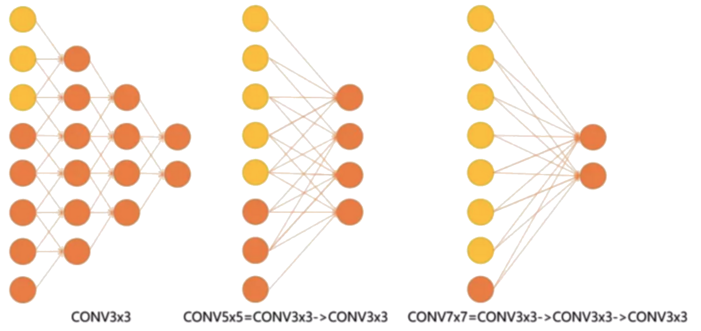

# VGG

## 网络结构

### 堆叠卷积核

- 一次 \\(5 \times 5\\) 卷积相当于两次 \\(3 \times 3\\) 卷积，一次 \\(7 \times 7\\) 卷积相当于三次 \\(3 \times 3\\) 卷积

- 当特征图维度相同时，两次 \\(3 \times 3\\) 卷积的计算量小于 \\(5 \times 5\\) 卷积的计算量，三次 \\(3 \times 3\\) 卷积的计算量小于 \\(7 \times 7\\) 卷积的计算量

	

### VGG-16

- 共 \\(16\\) 层，包括 \\(5\\) 组卷积层，\\(3\\) 个全连接层

	

#### 输入层 Input

- 输入为 \\(224 \times 224\\) 的 RGB 图像

#### 卷积层 Conv1

- 对 Input 数据进行两次卷积，特征图维度为 \\(224 \times 224\\)

	- 两次卷积核结构相同：大小为 \\(3\\)，步长为 \\(1\\)，padding 为 \\(1\\)

- 对特征图进行 ReLU 和池化，特征图维度为 \\(112 \times 112\\)

	- 池化核大小为 \\(2\\)，步长为 \\(2\\)，使用 max pooling

#### 卷积层 Conv2

- 对 Conv1 结果进行两次卷积，特征图维度为 \\(112 \times 112\\)

	- 两次卷积核结构相同：大小为 \\(3\\)，步长为 \\(1\\)，padding 为 \\(1\\)

- 对特征图进行 ReLU 和池化，特征图维度为 \\(56 \times 56\\)

	- 池化核大小为 \\(2\\)，步长为 \\(2\\)，使用 max pooling

#### 卷积层 Conv3

- 对 Conv2 结果进行三次卷积，特征图维度为 \\(56 \times 56\\)

	- 三次卷积核结构相同：大小为 \\(3\\)，步长为 \\(1\\)，padding 为 \\(1\\)

- 对特征图进行 ReLU 和池化，特征图维度为 \\(28 \times 28\\)

	- 池化核大小为 \\(2\\)，步长为 \\(2\\)，使用 max pooling

#### 卷积层 Conv4

- 对 Conv3 结果进行三次卷积，特征图维度为 \\(28 \times 28\\)

	- 三次卷积核结构相同：大小为 \\(3\\)，步长为 \\(1\\)，padding 为 \\(1\\)

- 对特征图进行 ReLU 和池化，特征图维度为 \\(14 \times 14\\)

	- 池化核大小为 \\(2\\)，步长为 \\(2\\)，使用 max pooling

#### 卷积层 Conv5

- 对 Conv4 结果进行三次卷积，特征图维度为 \\(14 \times 14\\)

	- 三次卷积核结构相同：大小为 \\(3\\)，步长为 \\(1\\)，padding 为 \\(1\\)

- 对特征图进行 ReLU 和池化，特征图维度为 \\(7 \times 7\\)

	- 池化核大小为 \\(2\\)，步长为 \\(2\\)，使用 max pooling

#### 全连接层 FC6

- 与 Conv5 进行全连接，生成向量维度为 \\(4096\\)

- 对生成向量先 ReLU 再 dropout，不改变生成向量维度

#### 全连接层 FC7

- 与 FC6 进行全连接，生成向量维度为 \\(4096\\)

- 对生成向量先 ReLU 再 dropout，不改变生成向量维度

#### 全连接层 FC8

- 与 FC7 进行全连接，生成向量维度为 \\(2622\\)

#### 输出层 Output

- 对 FC8 生成向量进行 softmax，计算每一类的概率

### VGG-19

- 共 \\(19\\) 层，包括 \\(5\\) 组卷积层，\\(3\\) 个全连接层

- 与 VGG-16 结构基本相同，区别是 Conv4 与 Conv5 阶段均进行四次卷积

## 主要改进

- 将卷积核全部替换为 \\(3 \times 3\\) 的小卷积核

- 相比于 AlexNet，池化核更小，仅为 \\(2 \times 2\\)

- 小卷积核堆叠使得网络加深的同时，计算量增加较少