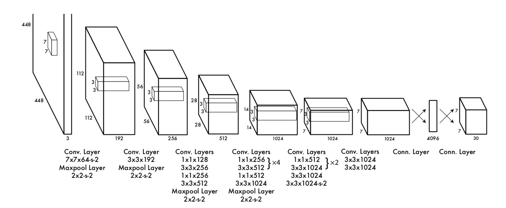

# YOLO

## YOLO v1

### 思想

- 不选择 Region Proposal，直接在输出层回归目标的位置和对应分类

- 由于省略了 Region Proposal 过程，速度可以达到 45FPS；代价是精度降低

### 检测流程

#### Grid

- 输入图像划分成 \\(S \times S\\) 的 Grid，每个 Grid 对应 \\(B\\) 个 BBox 向量 \\((conf, x, y, w, h)\\) 和一个 \\(C\\) 分类的向量，最终输出为 \\(S \times S \times (5B + C)\\) 维向量

	- \\((x, y)\\) 是 BBox 中心相对于当前 Grid 左上角的位移，归一化到 \\([0, 1)\\)

	- \\((w, h)\\) 是 BBox 相对于输入图像的宽和长，归一化到 \\([0, 1)\\)

		- 由损失函数部分可知，\\((w, h)\\) 实际是归一化后的平方根

	- \\(conf\\) 代表了所预测的 BBox 中有目标的置信度和 BBox 回归精度的两重信息：

		$$ conf = Pr(Object) \cdot IoU^{Truth}\_{Pred} $$

		- 如果有目标的中心落在当前 Grid 中，\\(Pr(Object) = 1\\)；否则 \\(Pr(Object) = 0\\)

- 在 PASCAL VOC 上，\\(S = 7, B = 2, C = 20\\)，输出为 \\(7 \times 7 \times (5 \times 2 + 20) = 1470\\) 维，最多可以检测 \\(7 \times 7 \times 2 = 98\\) 个目标

#### 训练

- 对于有目标中心落入的每个 Grid，从其预测的 \\(B\\) 个 BBox 中选择与 Ground Truth 的 \\(IoU\\) 最大的一个，负责对 Ground Truth 的预测，用于计算 loss

- 对各种 loss 加权求和：

	- BBox loss 和 Softmax loss 权重不应该相同

		- 更重视对 BBox 的预测，\\(\lambda\_{coord} = 5\\)

	- 如果一个 BBox 中没有目标，其 Confidence 会被置零；由于大部分 BBox 中没有目标，会导致网络训练不稳定

		- 对于没有目标的 BBox，其 loss 影响较小，\\(\lambda\_{noobj} = 0.5\\)

- Loss 由以下 5 项组成：

	- BBox 位置 Loss

		$$ \lambda\_{coord} \sum\_{i=0}^{S^{2}}\sum\_{j=0}^{B} \mathbb{1}\_{ij}^{obj} \left[ \left(x\_{i} - \hat{x\_{i}}\right)^{2} + \left(y\_{i} - \hat{y\_{i}}\right)^{2}\right] $$

		- \\(\mathbb{1}^{obj}\_{ij}\\) 判断第 \\(i\\) 个 Grid 中的第 \\(j\\) 个 BBox 是否负责预测 Ground Truth

	- BBox 尺度 Loss

		$$ \lambda\_{coord} \sum\_{i=0}^{S^{2}}\sum\_{j=0}^{B} \mathbb{1}\_{ij}^{obj} \left[ \left(\sqrt{w\_{i}} - \sqrt\{\hat{w\_{i}}}\right)^{2} + \left(\sqrt{h\_{i}} - \sqrt{\hat{h\_{i}}}\right)^{2}\right] $$

		- \\(w\\) 或 \\(h\\) 差距相同时，小物体的 loss 应该更大

	- 目标的 Confidence Loss

		$$ \sum\_{i=0}^{S^{2}} \sum\_{j=0}^{B} \mathbb{1}^{obj}\_{ij} \left(C\_{i} - \hat{C\_{i}}\right)^{2} $$

	- 背景的 Confidence Loss

		$$ \lambda\_{noobj} \sum\_{i=0}^{S^{2}} \sum\_{j=0}^{B} \mathbb{1}^{noobj}\_{ij} \left(C\_{i} - \hat{C\_{i}}\right)^{2} $$

	- 分类 Loss

		$$ \sum\_{i=0}^{S^{2}} \mathbb{1}^{obj}\_{i} \sum\_{c \in classes} \left(p\_{i} \ (c) - \hat{p\_{i}} \ (c)\right)^{2} $$

		- \\(\mathbb{1}^{obj}\_{i}\\) 判断是否有目标中心落在第 \\(i\\) 个 Grid 中

- 由 loss 定义可知：

	- 只有某个 Grid 中有目标的时候，才惩罚分类 loss

	- 只有某个 BBox 负责预测某个 Ground Truth 时，才惩罚 BBox 和 Confidence loss

		- 具体惩罚哪个 BBox，根据 \\(IoU\\) 决定

#### 测试

- 根据 Confidence 和分类信息，计算每个 Grid 的每个 BBox 对每个类别的置信度：

	$$ Pr(Object) \cdot IoU^{Truth}\_{Pred} \cdot Pr(Class\_{i} | Object) = Pr(Class\_{i}) \cdot IoU^{Truth}\_{Pred} $$

- 过滤掉置信度较低的 BBox，通过 NMS 得到最终的检测结果

### 网络结构

- 输入图像缩放到 \\(448 \times 448\\)

- 最后的两个全连接层输出 \\(1470\\) 维向量

- 采用 Leaky ReLU 作为激活函数

### 缺点

- 对靠太近的物体、小群体的检测效果不好

	- 多个目标中心落在同一 Grid 上，但每个 Grid 只能预测两个 BBox，而且只属于一类

- 对小目标的定位准确性较差

	- 训练时小目标和大目标的 BBox loss 对损失函数影响相同（平方根只是缓解，不能彻底解决问题）

## YOLO v2

### 思想

- 采用一系列方法进行优化，保证 YOLO v1 速度的情况下，提高检测精度

### Better

#### Batch Normalization

- 在每一个卷积层之后添加 Batch Normalization 层，解决 Covariate Shift 问题

- 同时在一定程度上对模型进行正则化约束

#### 高分辨率分类器

- 检测算法大多使用 ImageNet 上的预训练模型提取特征，但这些分类模型的输入一般是 \\(224 \times 224\\)，导致分辨率够高，会给检测带来困难

- 在 YOLO v2 中，首先在 ImageNet 上对 \\(448 \times 448\\) 的分类模型进行 fine-tuning，再在检测任务上进行 fine-tuning

#### Anchor 思想

- YOLO v1 使用最后的全链接层预测 BBox，导致较多空间信息的丢失，定位不准

- 借鉴 Faster R-CNN 的 Anchor 思想预测 BBox；去掉全连接层和最后的 pooling 层，以确保输出的特征图具有更高的分辨率

- 修改输入尺寸为 \\(416 \times 416\\)，使最后一层特征图尺寸为奇数 \\(13 \times 13\\)

	- 经过 5 次 pooling，特征图缩小 32 倍

	- 大目标通常占据图像的中间位置

		- 如果特征图是奇数，只需使用中间的 1 个 Cell 进行预测

		- 如果特征图是偶数，需要使用中间的 4 个 Cell 进行预测

#### K-means 聚类

- 在 Faster R-CNN 中，需要人工选择 Anchor；如果可以选择更好的 Anchor，模型的学习会更容易

- 通过 K-means 对 Ground Truth 进行聚类，根据 \\(k\\) 个聚类中心的尺寸，设置 Anchor

	- 如果使用欧式距离，大目标会比小目标产生更多的误差，导致聚类中心偏向大目标

	- 使用 \\(IoU\\) 作为距离衡量的标准，消除尺度对聚类误差的影响：

		$$ D(box, center) = 1 - IoU(box, center) $$

	- \\(k = 5\\) 时，模型复杂度和召回率达到较好的平衡点

#### 直接预测位置

- 直接使用 Anchor 时，模型训练不稳定，主要问题是 BBox 对 \\((x, y)\\) 偏移量的预测

	- 由于没有数值限定，可能导致 Anchor 预测很远的 BBox 目标，效率较低

	- 正确的做法是，每一个 Anchor 只负责周围的 BBox

- 将 BBox 的位置预测值改为相对于 Cell 左上角的偏移量

	- Cell 左上角坐标用其位置表示，\\((c\_{x}, c\_{y})\\) 表示第 \\((c\_{x}, c\_{y})\\) 个 Cell

	- BBox 预测值 \\((t\_{x}, t\_{y})\\) 通过 Sigmoid 函数归一化到 \\((0, 1)\\) 范围

	- 最终的 BBox 计算如下：

		$$ b\_{x} = \sigma(t\_{x}) + c\_{x} $$

		$$ b\_{y} = \sigma(t\_{y}) + c\_{y} $$

		$$ b\_{w} = p\_{w} \cdot e^{t\_{w}} $$

		$$ b\_{h} = p\_{h} \cdot e^{t\_{h}} $$

#### 细粒度特征

- \\(13 \times 13\\) 的特征图足以进行大目标的检测，但对小目标的检测效果较差

- 把浅层的 \\(26 \times 26\\) 进行特征重排后，与 \\(13 \times 13\\) 的特征图进行拼接，方便小目标检测

	- 通过隔行隔列采样，\\(26 \times 26\\) 的特征图可以得到 4 个 \\(13 \times 13\\) 特征图

#### 多尺度训练

- 为了保证 YOLO v2 在不同尺度输入图像上的性能，进行多尺度训练

	- 每隔 10 个 batch，随机选择一种新尺寸的输入图像进行训练

- 由于特征图维度变为原图的 \\(1 / 32\\)，训练时使用 \\(32\\) 的整数倍作为输入图像尺寸：

	$$ (320, \ 352, \cdots, \ 608) $$

#### Anchor 输出

- 每个 Anchor 的输出是 \\(5 + C\\) 维的向量

	- \\(5\\) 维分别是 \\((t\_{x}, \ t\_{y}, \ t\_{w}, \ t\_{h}, \ conf)\\)

		- \\(t\_{x}, t\_{y}\\) 是 BBox 中心相对于当前 Cell 左上角的偏移百分比

		- \\(t\_{w}, t\_{h}\\) 是 BBox 的尺度变换量

		- \\(conf\\) 代表所预测的 BBox 中有目标的置信度和 BBox 回归精度的两重信息：

			$$ conf = Pr(Object) \cdot IoU^{Truth}\_{Pred} $$

			- 如果有目标的中心落在当前 Grid 中，\\(Pr(Object) = 1\\)；否则 \\(Pr(Object) = 0\\)

	- \\(C\\) 维分别是当前目标属于 \\(C\\) 个前景类的概率 \\(Pr(Class\_{i} | Object)\\)

	- 每个 BBox 对每个类别的置信度计算如下：

		$$ Pr(Class\_{i}) \cdot IoU^{Truth}\_{Pred} = Pr(Object) \cdot IoU^{Truth}\_{Pred} \cdot Pr(Class\_{i} | Object) $$

### Faster

#### Darknet-19

- 使用 Darknet-19 作为基础网络，相比 VGG 和 GoogLeNet，运算速度更快，精度更高

- Darknet-19 共有 7 组卷积，卷积层数依次为 \\(1, \ 1, \ 3, \ 3, \ 5, \ 5, 1\\)

	- 前 6 组卷积之间通过 \\(stride = 2\\) 的 \\(2 \times 2\\) pooling 实现下采样

	- 最后的卷积层经过 global average pooling 后进行 Softmax 分类

	- 7 组卷积核大小依次为 \\(3, \ 3, \ 3-1-3, \ 3-1-3, \ 3-1-3-1-3, \ 3-1-3-1-3, \ 3\\)

- 共 19 个卷积层，5 个 pooling 层