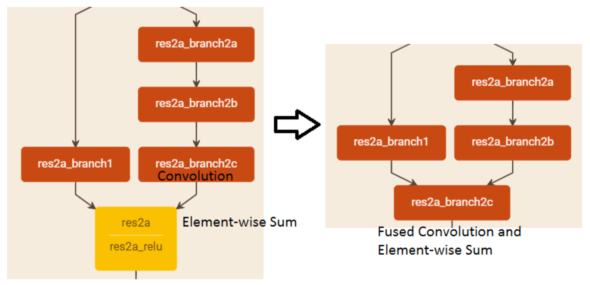
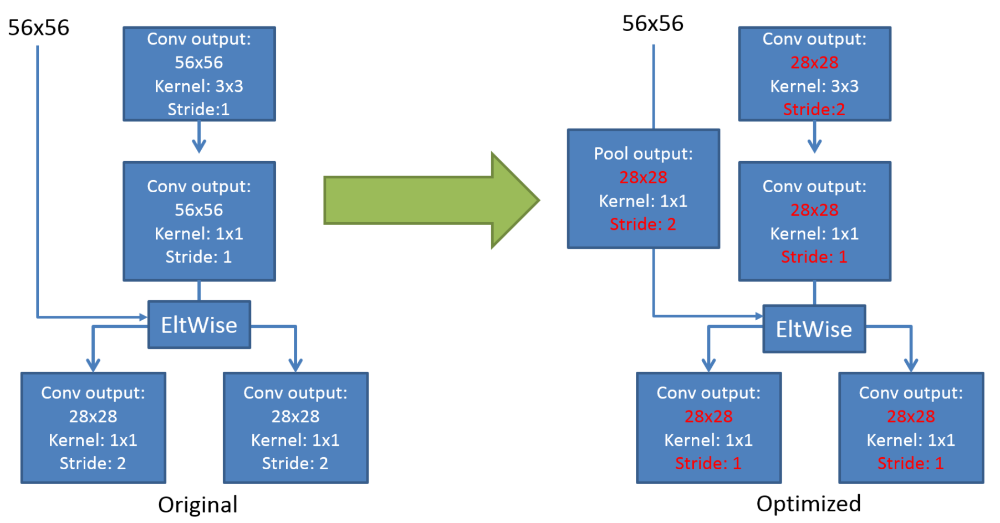

# $\mathrm{IntelCaffe}$

## 加速原理

### $\mathrm{MKLDNN}$ 计算引擎

- 基于 $\mathrm{MKLDNN}$ 重写了常用的网络层，包括但不限于 $\mathrm{Convolution}$、$\mathrm{BatchNorm}$、$\mathrm{InnerProduct}$、$\mathrm{Pooling}$、$\mathrm{Concat}$、$\mathrm{Eltwise}$、$\mathrm{ReLu}$等

### 低精度运算

- 支持四分之一精度进行计算，精度轻微下降，速度提升明显

### 合并 $\mathrm{Eltwise}$ 层与卷积层

- 对于多分支网络，在计算最后一个卷积层的时，直接输出与其它分支相加的结果，从而减少原网络中后续 $\mathrm{Eltwise}$ 层对该卷积层的重复访存

- 通过在卷积参数中设置 $\mathrm{fusion\_type: \ SUM\_FUSION}$ 实现

### 去除 $\mathrm{ReLU}$ 层

- 对于卷积层、全连接层、$\mathrm{Eltwise}$层，融合后置的 $\mathrm{ReLU}$ 层

- 通过在参数中设置 $\mathrm{relu}$ 变量和 $\mathrm{negative\_slope}$ 值实现

- 下图显示了对 $\mathrm{ResNet}$ 的 $\mathrm{Eltwise}$ 优化

### 去除 $\mathrm{BatchNorm}$ 层

- 对于卷积层或全连接层，融合后置的 $\mathrm{BatchNorm}$ 层，通过以下公式更新当前层的权重：

$$
w_{\mathrm{new}} = \left( \frac{\gamma}{\sqrt{\sigma^{2} + \epsilon}} \right) \cdot w_{\mathrm{old}}
$$

$$
b_{\mathrm{new}} = \left( \frac{\gamma}{\sqrt{\sigma^{2} + \epsilon}} \right) \cdot \left( b_{\mathrm{old}} - \mu \right) + \beta
$$

  - 其中 $\mu, \ \sigma^{2}$ 分别为 $\mathrm{BatchNorm}$ 层的均值和方差，$\gamma, \ \beta$ 分别为 $\mathrm{Scale}$ 层的权重和偏置，$\epsilon$ 保证数值稳定性

### 提前下采样

- 对于类 $\mathrm{ResNet}$ 结构的下采样 $\mathrm{Bottleneck}$，两个分支均通过 $1 \times 1$ 卷积实现；由于 $1 \times 1$ 卷积核及 $\mathrm{stride = 2}$ 的设置，每一个特征图均有 $3/4$ 的特征被丢弃，不参与当前和后续计算

- 除此之外，在上一个 $\mathrm{Bottleneck}$ 的卷积分支中，最后一个 $1 \times 1$ 卷积特征，也有 $3/4$ 的数据被丢弃

- 通过将上一个 $\mathrm{Bottleneck}$ 卷积分支的 $3 \times 3$ 卷积设置为 $\mathrm{stride = 2}$，同时将其 $\mathrm{shortcut}$ 分支改为 $\mathrm{stride = 2}$ 的 $\mathrm{1 \times 1 \ \mathrm{Pooling}}$，可以在不影响结果的同时减少上述冗余计算，示意如下：

