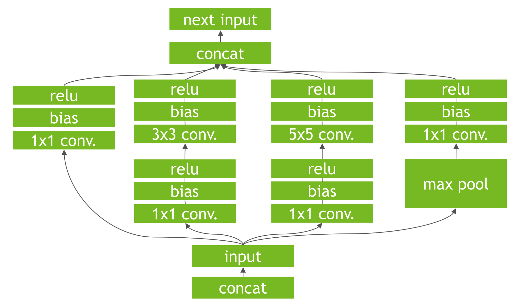
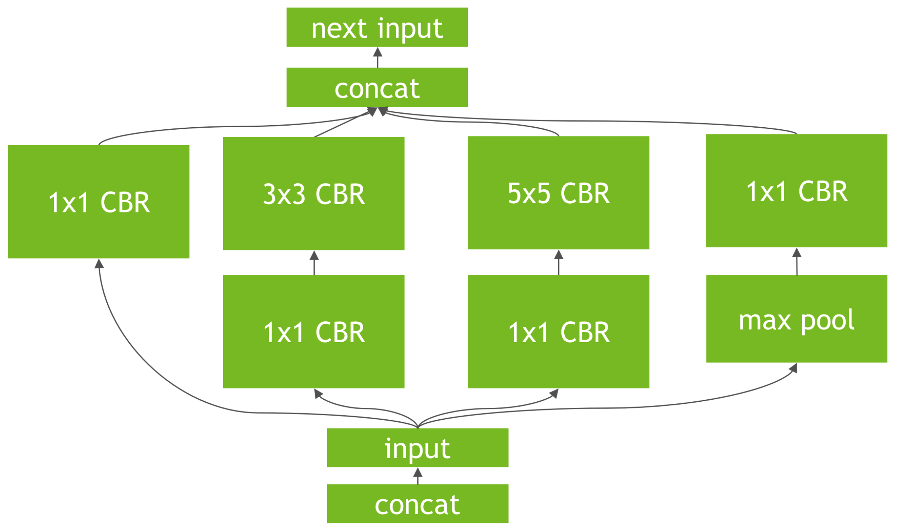
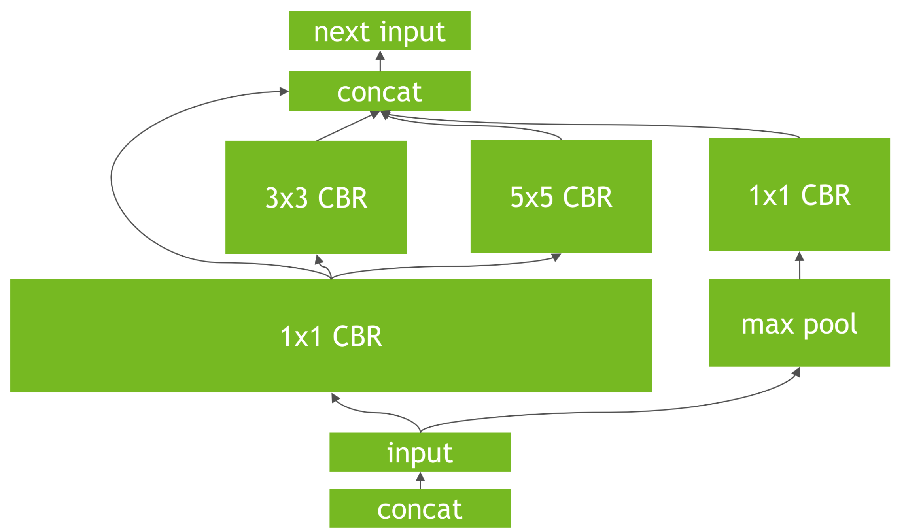

# TensorRT

## 加速原理

- 以 Inception v1 的节点为例，原始结构如下：

	- 卷积层的计算实际分为两步：计算卷积，加偏置项

		

### 删除无关层

- 删除没有用到的输出层和相关层，减少计算量

### Concat 优化

- 直接预分配连续显存，并将计算结果写入到对应区域；不再进行 Concat 操作

### 低精度计算

- 使用半精度甚至四分之一精度进行计算，精度几乎没有损失，速度提升明显

### 内核融合

- 垂直方向：将多个串行节点节点合并进一个计算节点，减少 GPU 内核启动次数

	- 将卷积层和激活层合并得到 CBR（Convolution + Bias + ReLU）如下：

		

- 水平方向：合并输入相同、操作相同的层，分别计算每一部分，减少内核启动次数

	- 将来自同一输入的 \\(1 \times 1\\) 卷积后，得到的计算图如下：

	 

## 基本流程

- 将 Caffe、Tensorflow 等模型转换成 GIE 可以运行的模型，或直接从磁盘加载

	- GIE 全称是 GPU Inference Engine

	- 在转换过程中，进行上述优化

- 将数据拷贝到 GPU 并通过 GIE 计算，将计算结果拷回 CPU

- 对于 TensorRT 原生不支持的层，可以自己写插件实现