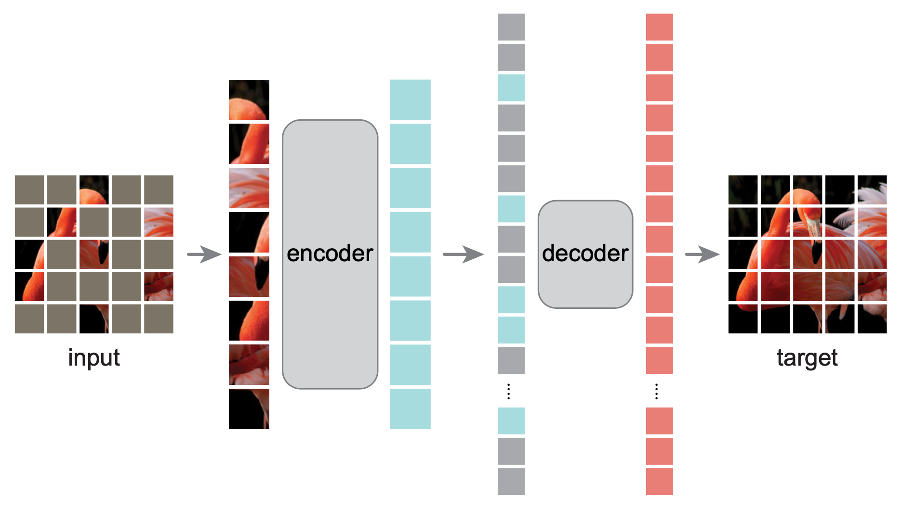

# $\mathrm{MAE}$

## 提出背景

- 基于自监督的方式，在相对较小数据集上对 $\mathrm{ViT}$ 进行训练，提高模型精度

## 基本思想

- 对图片的一部分进行 $\mathrm{mask}$ 去除，通过 $\mathrm{Encoder-Decoder}$ 还原原始图片

### $\mathrm{NLP, \ CV}$ 区别

- 类似方法在 $\mathrm{NLP}$ 领域有效，但在 $\mathrm{CV}$ 领域表现较差，可能原因如下

  - 模型结构不同：传统的 $\mathrm{CNN}$ 结构，不太容易界定 $\mathrm{mask}$ 的部分

    - $\mathrm{ViT}$ 的出现可以弥补这一差距

  - 信息密度不同：语言的 $\mathrm{word}$ 特征包含信息密度较大，$\mathrm{mask}$ 一小部分即可掩盖大量信息；但图片像素存在较大冗余，很容易通过周围像素进行重建

    - 提高 $\mathrm{mask}$ 的比例可以解决这一问题

## 模型结构

- 基于 $\mathrm{ViT}$ 结构

### $\mathrm{Masking}$

- 对图像 $\mathrm{patch}$ 进行随机不重复采样（建议 $75\%$），从而减少像素冗余，迫使模型学习全局特征

  - 具体操作时，会对所有 $\mathrm{patch}$ 进行 $\mathrm{shuffle}$ 打乱，只保留前边特定比例部分

### $\mathrm{Encoder}$

- 标准的 $\mathrm{ViT}$ 结构的 $\mathrm{Encoder}$ 部分

- 不同的是，输入不是所有 $\mathrm{patch}$，而是只有未被 $\mathrm{mask}$ 的部分，节省计算开销

### $\mathrm{Decoder}$

- 由于需要重构被 $\mathrm{mask}$ 的像素，因此输入包含两部分：

  - 未被 $\mathrm{mask}$ 的 $\mathrm{patch}$ 的特征向量，被 $\mathrm{mask}$ 的 $\mathrm{patch}$ 信息（通过共享的可学习特征向量表示）

- $\mathrm{Decoder}$ 同样也是 $\mathrm{Transformer \ Block}$ 结构，同样包含 $\mathrm{Position \ Embedding}$ 信息

- 仅用于自监督的 $\mathrm{PreTrain}$，不用于下游任务

### 优化目标

- 像素级的 $\mathrm{MSE}$，仅在未 $\mathrm{mask}$ 的保留 $\mathrm{patch}$ 上计算

### 下游任务

- 不管是针对所有层的 $\mathrm{fine-tuning}$ 微调，还是只针对线性层的 $\mathrm{linear-probing}$ 微调，都有不错效果

## 结论

- 基于 $\mathrm{MAE}$，仅在 $\mathrm{ImageNet}$ 数据集上也可以训练 $\mathrm{ViT-L/H}$ 并取得 $\mathrm{SOTA}$ 结果