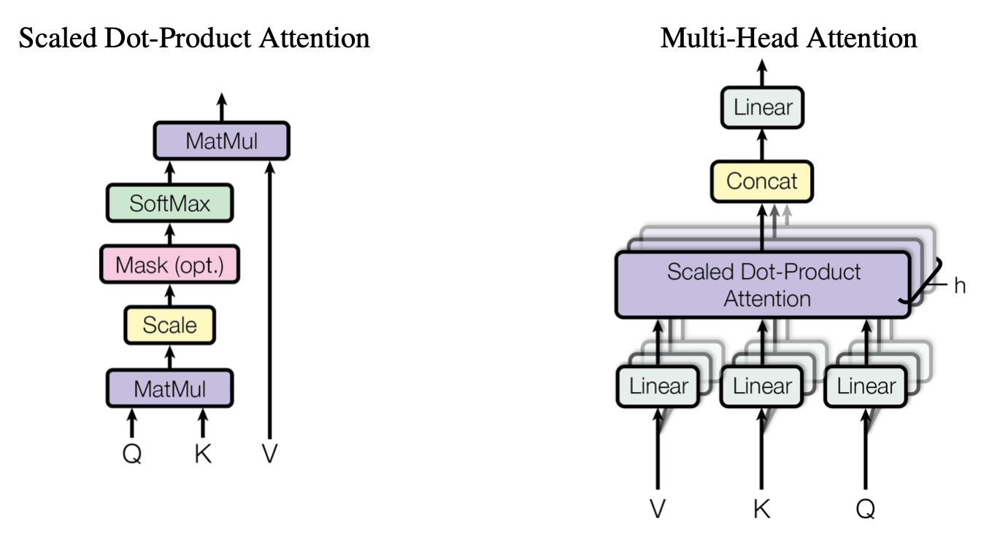
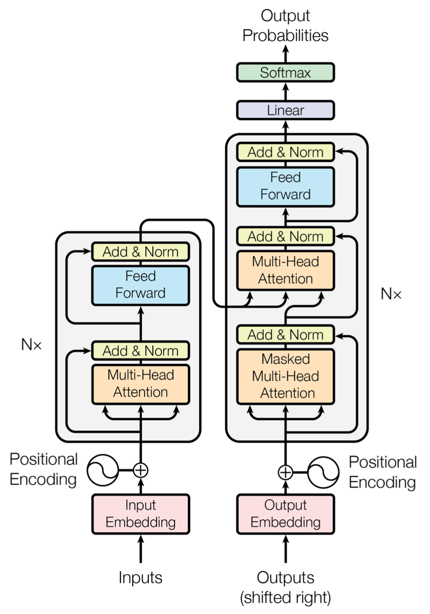

# $\mathrm{Transformer}$

## 提出背景

- 受限于时序，$\mathrm{RNN}$ 的计算只能是顺序的

  - $\mathrm{RNN}$ 相关算法只能从左往右依次计算，或者从右往左依次计算，无法大规模并行

- $\mathrm{RNN}$ 的上述机制存在以下问题

  - $\mathrm{T}$ 时刻的计算，依赖于 $\mathrm{T - 1}$ 时刻的计算结果，限制了模型的计算能力

  - 顺序计算的过程中信息会丢失，对于长期依赖问题，无能为力

## 模型结构

- $\mathrm{Transformer}$ 由 $\mathrm{Encoder}$ 和 $\mathrm{Decoder}$ 两部分组成，分别包含 $6$ 个 $\mathrm{block}$，工作流程如下：

  - 获取输入句子的每一个单词的表示向量 $\mathrm{x}$，$\mathrm{x}$ 由单词的 $\mathrm{Embedding}$ 和位置的 $\mathrm{Embedding}$ 相加得到

  - 将所有单词的表示向量矩阵 $\mathrm{X}$ 传入 $\mathrm{Encoder}$，得到句子中所有单词的编码信息矩阵 $\mathrm{C}$

  - 将 $\mathrm{Encoder}$ 输出的编码信息矩阵 $\mathrm{C}$ 传入 $\mathrm{Decoder}$，依次根据翻译过的前 $\mathrm{i}$ 个单词，翻译第 $\mathrm{i + 1}$ 个单词

  - 实际使用时，需要通过 $\mathrm{mask}$ 操作实现

## 输入 $\mathrm{Embedding}$

### 单词 $\mathrm{Embedding}$

- 可通过预训练 $\mathrm{NLP}$ 模型得到，也可在 $\mathrm{Transformer}$ 中训练得到

### 位置 $\mathrm{Embedding}$

- 与 $\mathrm{RNN}$ 不同，$\mathrm{Transformer}$ 直接使用全局信息，不能利用单词的顺序信息

  - 通常位置信息对 $\mathrm{NLP}$ 任务而言非常重要

- 因此 $\mathrm{Transformer}$ 需要使用位置 $\mathrm{Embedding}$ 保存单词在序列中的相对位置或绝对位置

- 位置 $\mathrm{Embedding}$ 可以通过训练得到，也可通过正余弦公式计算得到

  - 通过训练方式得到的位置 $\mathrm{Embedding}$ 只能处理固定长度 $\mathrm{Sequence}$

  - 通过三角函数计算得到的位置 $\mathrm{Embedding}$ 可以处理任意长度 $\mathrm{Sequence}$

## $\mathrm{Self-Attention}$

### $\mathrm{Self-Attention}$

- $\mathrm{Self-Attention}$ 的输入是 $\mathrm{Embedding}$ 向量或上一个 $\mathrm{Encoder \ block}$ 输出

- $\mathrm{Q, \ K, \ V}$ 是 $\mathrm{Self-Attention}$ 输入的线性变换

  $$
  \mathrm{Q = XW^{Q}, \quad K = XW^{K}, \quad V = XW^{V}}
  $$

- $\mathrm{Self-Attention}$ 的计算公式如下

  $$
  \mathrm{Attention \left( Q, \ K, \ V \right) = Softmax \left( \frac{QK^{T}}{\sqrt{d_{k}}} \right) \cdot V}
  $$
  
  - 其中 $\mathrm{d_{k}}$ 是 $\mathrm{Q, \ K}$ 的向量维度（方阵，行或列）

  - $\mathrm{QK^{T}}$ 类似自相关矩阵，每一行是当前向量与其它向量的内积结果，用于衡量相关性

  - $\mathrm{Softmax}$ 归一化每个向量与其他向量的相关系数，保证系数之和为 $1$

  - $\mathrm{Softmax \cdot V}$ 是根据向量间相关系数，对输入向量进行加权，体现 $\mathrm{Attention}$ 机制

#### $\mathrm{\sqrt{d_{k}}}$ 意义

- 假设 $\mathrm{Q, \ K}$ 均值为 $0$，方差为 $1$，那么 $\mathrm{A = Q^{T}K}$ 中元素均值为 $0$，方差为 $\mathrm{d_{k}}$

- 当 $\mathrm{d_{k}}$ 很大时，$\mathrm{Softmax \left( A \right)}$ 的方差较大，分布过于陡峭，分布集中在绝对值大的区域 

- $\mathrm{B = \frac{A}{\sqrt{d_{k}}}}$ 操作将得到方差为 $1$ 的 $\mathrm{B}$，保证训练过程中的梯度稳定

### $\mathrm{Multi-Head \ Attention}$

- 对 $\mathrm{Self-Attention}$ 进行拆分，形成多个子空间，可以让模型去关注不同方面的信息

  - 对于 $\mathrm{h}$ 个 $\mathrm{head}$，每个 $\mathrm{head}$ 的特征维度为 $\mathrm{\frac{d_{k}}{h}}$

- 同时，防止模型对当前位置的信息进行编码时，过度将注意力集中在自身位置

- 在进入下一个 $\mathrm{Encoder \ block}$ 或 $\mathrm{Decoder \ block}$ 前进行 $\mathrm{concat}$ 操作

## $\mathrm{Encoder-Decoder}$

### $\mathrm{Encoder}$

- 对输入 $\mathrm{ X = \{ x_{0}, \ x_{1}, \ ..., \ x_{m} \}}$ 进行编码，得到中间语义表示 $\mathrm{C =  \{ c_{0}, \ c_{1}, \ ..., \ c_{m} \}}$

- $\mathrm{Encoder}$ 的每个 $\mathrm{block}$ 由 $\mathrm{Multi-Head \ Attention}$ 和 $\mathrm{Feed \ Forward}$ 组成

- $\mathrm{Feed \ Forward}$ 由两个全连接层组成，第一层使用 $\mathrm{ReLU}$ 激活函数，第二层不使用激活函数

- $\mathrm{Multi-Head \ Attention}$ 和 $\mathrm{Feed-Forward}$ 都使用残差结构，通过 $\mathrm{Layer \ Normalization}$ 进行归一化

- 在 $\mathrm{Transformer}$ 中，$\mathrm{Encoder}$ 部分由 $6$ 个 $\mathrm{block}$  堆叠而成

### $\mathrm{Decoder}$

- 根据中间语义表示 $\mathrm{C =  \{ c_{0}, \ c_{1}, \ ..., \ c_{m} \}}$ 和已生成历史信息 $\{ y_{0}, \ y_{1}, \ ..., \ y_{i-1}\}$ 生成当前 $\mathrm{i}$ 时刻的信息 $y_{i}$

- $\mathrm{Decoder}$ 结构与 $\mathrm{Encoder}$ 类似，但存在以下区别：

  - 每个 $\mathrm{block}$ 包含两个 $\mathrm{Multi-Head \ Attention}$ 层

  - 第一个 $\mathrm{Multi-Head \ Attention}$ 层采用了 $\mathrm{mask}$ 操作

  - 第二个 $\mathrm{Multi-Head \ Attention}$ 层的 $\mathrm{K, \ V}$ 矩阵使用 $\mathrm{Encoder}$ 的编码矩阵 $\mathrm{C}$ 进行计算，而 $\mathrm{Q}$ 矩阵使用上一个 $\mathrm{Decoder \ block}$ 的输出进行计算

#### $\mathrm{mask}$ 操作

- 训练阶段，$\mathrm{Decoder}$ 部分接收 $\mathrm{GroundTruth}$  作为输入，$\mathrm{Self-Attention}$ 可以利用全局信息。如果不使用 $\mathrm{mask}$，可能会利用当前位置之后的 $\mathrm{GroundTruth}$ 信息，相当于作弊

- 因此需要一个下三角矩阵，在经 $\mathrm{Softmax}$ 输出概率前，对当前位置之后的信息进行 $\mathrm{mask}$ 遮挡