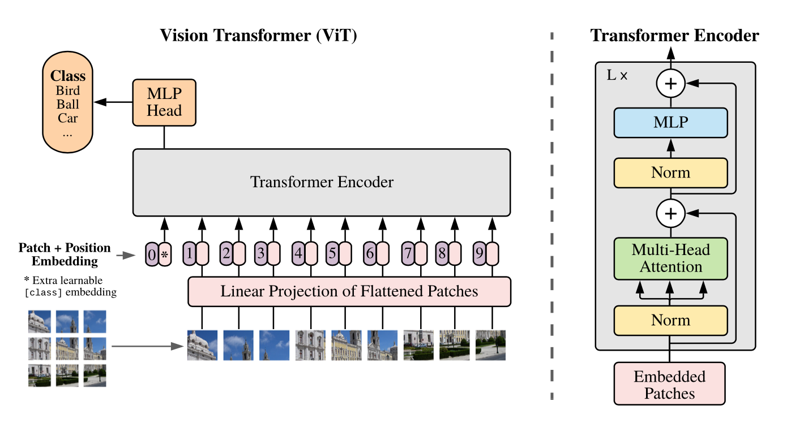

# $\mathrm{ViT}$

## 提出背景

- 基于纯 $\mathrm{Transformer}$ 来做图像分类任务

## 模型结构

### $\mathrm{Patch \ Embedding}$

- 分块处理，将图像结构转为词结构

- 假设输入图像为 $224 \times 224 \times 3$，将图像分为固定大小的 $\mathrm{patch}$，每个 $\mathrm{patch}$  的大小为 $16 \times 16 \times 3$，整张图像会产生 $ \left( 224 \times 224 \right) \ / \ \left( 16 \times 16 \right) = 196$ 个 $\mathrm{patch}$

- $\mathrm{Transformer}$ 内部实际需要的向量维度 $\mathrm{D} = 768$，因此（可能）需要对 $\mathrm{Patch}$ 进行 $\mathrm{Embedding}$，以匹配目标维度

  - 最简单的 $\mathrm{Embedding}$ 方式为一次线性变换，将每个 $\mathrm{Patch}$ 维度从 $\mathrm{16 \times 16 \times 3}$ （即 $\mathrm{P} = 16$） 压为 $\mathrm{D}$

  - 具体实现时，直接对输入图像进行 $\mathrm{kSize} = P, \ \mathrm{stride} = P, \ \mathrm{pad} = 0, \ \mathrm{outC} = D$ 卷积，再用 $\mathrm{transpose}$ 重排

### $\mathrm{Transformer}$

- 将 $\mathrm{Patch \ Embedding}$ 结果直接送到原始 $\mathrm{Transformer}$ 进行特征提取

  - 其中 $\mathrm{MLP}$ 部分通常由两个全连接层组成，前者 $\mathrm{GELU}$ 激活，后者不激活

  - 通常，第一个全连接层进行扩张通道数，第二个全连接层还原通道数

### $\mathrm{Class \ Token}$

- $\mathrm{Patch \ Embedding}$ 将输入图像转成 $\mathrm{N}$ 个向量通过 $\mathrm{Transformer}$ 进行特征提取后，得到 $\mathrm{N}$ 个输出向量

- 对于图像分类任务，将任何一个输出向量进行后续分类都不合适

- 因此，可以直接加入一个可学习的嵌入向量 $\mathrm{Class \ Token}$，并与其他 $\mathrm{N}$ 个 $\mathrm{Patch \ Embedding}$ 向量 $\mathrm{concat}$ 后作为 $\mathrm{Transformer}$ 输入，最终得到 $\mathrm{N + 1}$ 个输出向量，将这个 $\mathrm{Class \ Token}$ 对应的输出向量进行简单的全连接分类

### $\mathrm{Position \ Embedding}$

- 按照原始 $\mathrm{Transformer}$ 的习惯，同样进行位置编码

- 与原始 $\mathrm{Transformer}$ 不同的是，$\mathrm{ViT}$ 简单使用了可学习的位置编码

- 将 $\mathrm{Position \ Embedding}$ 结果与 $\mathrm{Patch \ Embedding}$ 简单相加后，作为 $\mathrm{Transformer}$ 最终输入

- 实验结果表明，不同的 $\mathrm{Position \ Embedding}$ 方式对最终结果影响不大

## 结论

- 只在小规模数据集上训练时，$\mathrm{ViT}$ 效果明显比 $\mathrm{ResNet}$ 等传统 $\mathrm{CNN}$ 模型差

- 但同样在大规模数据集（比如$\mathrm{ImageNet-21K, \ JFT-300M}$）上预训练后，$\mathrm{ViT}$ 效果更好

- 一个可能的原因是，$\mathrm{Transformer}$ 缺乏 $\mathrm{CNN}$ 的平移不变性、局部像素相似性这两个特性

  - 因此在数据量较小时，训练学习不够充分