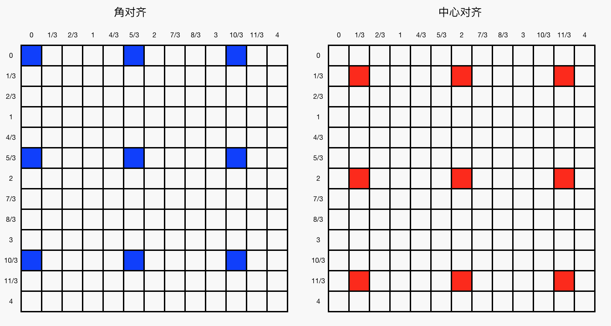
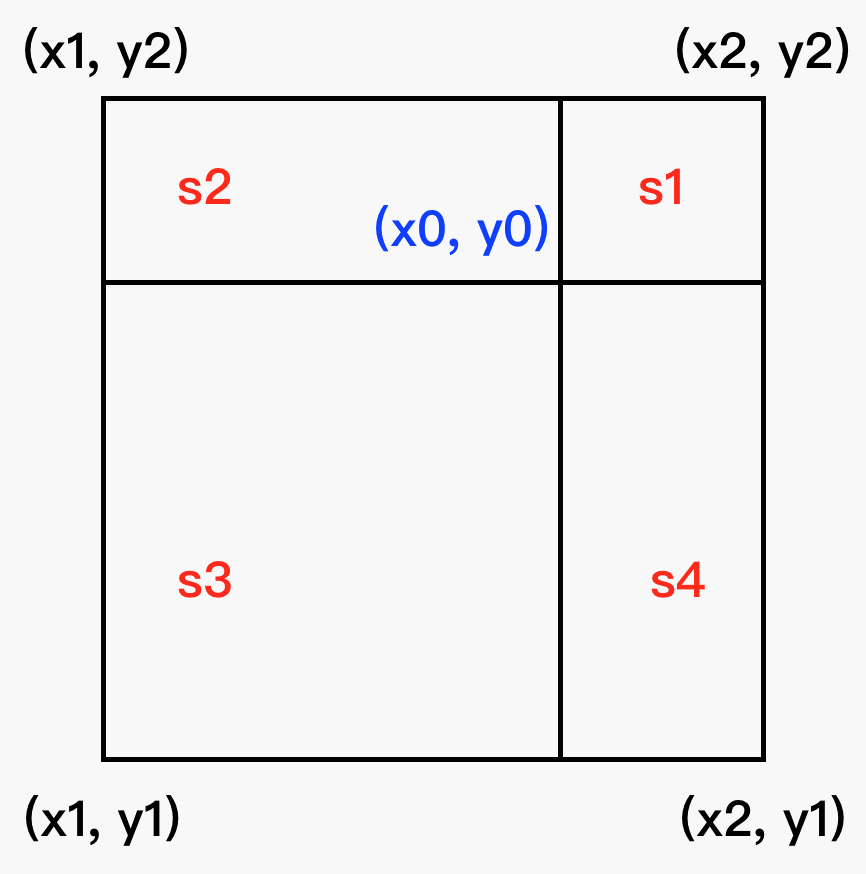

<script type="text/javascript" src="http://cdn.mathjax.org/mathjax/latest/MathJax.js?config=default"></script>

# 双线性插值

## 背景介绍

- 通过在 x、y 两个方向分别插值，实现对图像的平滑缩放

## 原理分析

### 线性插值

- 已知直线上两定点 \\((x\_{1}, y\_{1}), \ (x\_{2}, y\_{2})\\)，两点连线间任意一点的坐标为 \\((x,y)\\)

- 根据共线可得：

	$$ \frac{y-y\_{1}}{x-x\_{1}} = \frac{y\_{2}-y\_{1}}{x\_{2}-x\_{1}} \quad \Rightarrow \quad y = \frac{x-x\_{1}}{x\_{2}-x\_{1}} \cdot y\_{2} + \frac{x\_{2}-x}{x\_{2}-x\_{1}} \cdot y\_{1} $$

- 因此，越靠近 \\((x\_{1},y\_{1})\\)，\\(y\\) 值越接近 \\(y\_{1}\\)，越靠近 \\((x\_{2},y\_{2})\\)，\\(y\\) 值越接近 \\(y\_{2}\\)

### 双线性插值

- \\(f(x,y)\\) 表示像素值；\\((x,y)\\) 是缩放后的图像坐标，\\((x\_{0}, y\_{0})\\) 是原图像的对应坐标，\\((x\_{0},y\_{0})\\) 可通过缩放比由 \\((x,y)\\) 计算得到，缩放比定义为缩放前、后的图像尺寸之比

#### 坐标缩放

- 由 \\((x,y)\\) 计算 \\((x\_{0},y\_{0})\\) 有两种方式：

	- 角对齐：

		$$ \\left\\{ \begin{matrix} x\_{0} = x \cdot scaleX \\\\ y\_{0} = y \cdot scaleY \end{matrix} \\right\. $$

	- 中心对齐：

		$$ \\left\\{ \begin{matrix} x\_{0} = (x + 0.5) \cdot scaleX - 0.5 \\\\ y\_{0} = (y + 0.5) \cdot scaleY - 0.5 \end{matrix} \\right\. $$

	

- 上图表示将 5 x 5 的图像缩放到 3 x 3 时，两种情况下分别计算的 \\((x\_{0},y\_{0})\\) 分布：

	- 角对齐时，右下方的像素值不能被充分利用

	- 中心对齐时，两张图像的几何中心重合，能充分利用周围的像素值

- 不难发现，中心对齐可由角对齐平移 \\(\Delta\\) 得到，推导如下：

	- 假设要将 M x M 的图像缩放到 N x N，因此缩放比 \\(scale = \frac{M}{N}\\)

	- 由上图（中心对齐）可知，应该有 N - 1 个大间隔，以及上、下、左、右各一个 \\(\Delta\\)，因此：

		$$ \frac{M}{N}(N-1) + 2\Delta = M - 1 \quad \Rightarrow \quad \Delta = 0.5 \cdot (scale - 1) $$

	- 而在角对齐中，\\(v\_{0} = v \cdot scale\\)，将 \\(\Delta\\) 代入可得：

		$$ v\_{0} = v \cdot scale + \Delta \quad \Rightarrow \quad \\left\\{ \begin{matrix} x\_{0} = (x + 0.5) \cdot scaleX - 0.5 \\\\ y\_{0} = (y + 0.5) \cdot scaleY - 0.5 \end{matrix} \\right\. $$
		
#### 插值计算

- \\((x\_{0},y\_{0})\\) 一般不为整数，因此需要用插值的方来法计算该点的像素值 \\(f(x\_{0},y\_{0})\\)

- 假设 \\(x\_{0}\\) 向下、向上取整分别得到 \\(x\_{1}, x\_{2}\\)， 而 \\(y\_{0}\\) 向下、向上取整分别得到 \\(y\_{1}, y\_{2}\\)

- 由线性插值公式易知：

	- x 方向：

		$$ \\left\\{ \begin{matrix} f(x\_{0},y\_{1}) = \frac{x\_{0}-x\_{1}}{x\_{2}-x\_{1}} \cdot f(x\_{2},y\_{1}) + \frac{x\_{2}-x\_{0}}{x\_{2}-x\_{1}} \cdot f(x\_{1},y\_{1}) \\\\ \\\\ f(x\_{0},y\_{2}) = \frac{x\_{0}-x\_{1}}{x\_{2}-x\_{1}} \cdot f(x\_{2},y\_{2}) + \frac{x\_{2}-x\_{0}}{x\_{2}-x\_{1}} \cdot f(x\_{1},y\_{2}) \end{matrix} \\right\. $$

	- y 方向：

		$$ f(x\_{0},y\_{0}) = \frac{y\_{0}-y\_{1}}{y\_{2}-y\_{1}} \cdot f(x\_{0},y\_{2}) + \frac{y\_{2}-y\_{0}}{y\_{2}-y\_{1}} \cdot f(x\_{0},y\_{1}) $$

	

- 设 \\(S\_{1}, S\_{2}, S\_{3}, S\_{4}\\) 分别表示四个区域的面积，由于 \\(x\_{2}-x\_{1}=y\_{2}-y\_{1}=1\\)，综合上式可得：

	$$ f(x\_{0},y\_{0}) = S\_{1} \cdot f(x\_{1},y\_{1}) + S\_{2} \cdot f(x\_{2},y\_{1}) + S\_{3} \cdot f(x\_{2}, y\_{2}) + S\_{4} \cdot f(x\_{1},y\_{2}) $$

- \\((x\_{0},y\_{0})\\) 越接近 \\((x\_{2},y\_{2})\\)，\\(S\_{3}\\) 就越大，\\(f(x\_{0},y\_{0})\\) 越接近 \\(f(x\_{2},y\_{2})\\)；其他方向同理

## Python 实现

```
response = cv2.resize(image, (width, height))
```