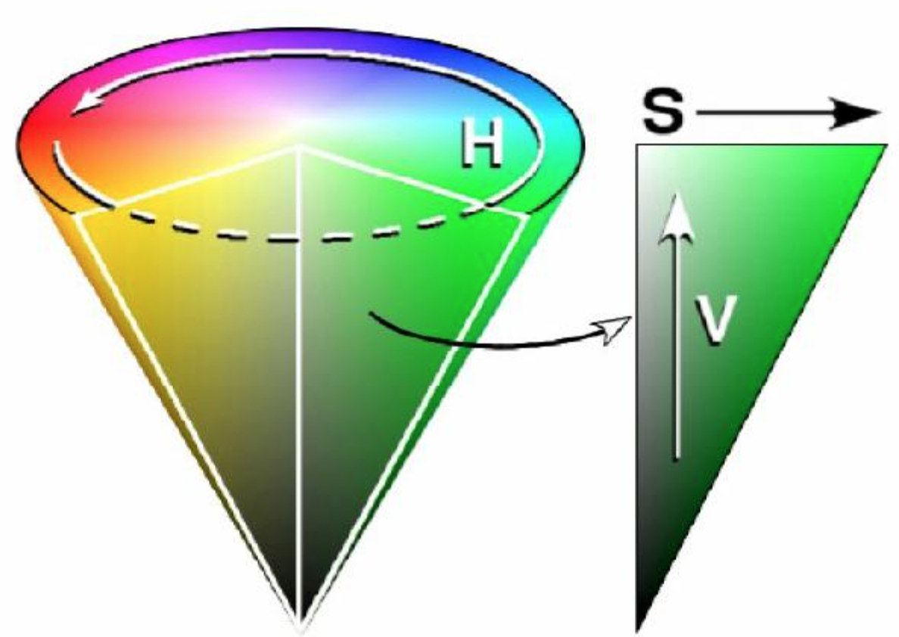

# 颜色空间

## $\mathrm{RGB}$

- $R$、$G$、$B$ 分别代表红色（$\mathrm{Red}$）、绿色（$\mathrm{Green}$）、蓝色（$\mathrm{Blue}$）

- 三个分量独立，取值范围均为 $0 - 255$：数值越大，颜色越亮

## $\mathrm{HSV}$

- $H$、$S$、$V$ 分别代表色相（$\mathrm{Hue}$）、饱和度（$\mathrm{Saturation}$）、亮度（$\mathrm{Value}$）

- 解决了 $\mathrm{RGB}$ 三通道取值与所生成颜色联系不够直观的问题

- 色相（$H$）指颜色的相位角，取值范围为 $0^{\circ} - 360^{\circ}$

  - 红色为 $0^{\circ}$，绿色为 $120^{\circ}$，蓝色为 $240^{\circ}$

- 饱和度（$S$）指颜色的纯度，取值范围为 $0.0 - 1.0$

  - 数值越大，颜色越纯

- 亮度（$V$）指色彩的明亮程度，取值范围为 $0.0 - 1.0$

  - 数值越大，颜色越亮

<center>

</center>

## $\mathrm{Python}$ 实现

### 显示 $\mathrm{RGB}$ 空间的每个通道

- $\mathrm{OpenCV}$ 按 $B$、$G$、$R$ 三个通道存储每个像素值

```python
empty = numpy.zeros((height, width), numpy.uint8)
b, g, r = cv2.split(image)

bb = cv2.merge([b, empty, empty])
gg = cv2.merge([empty, g, empty])
rr = cv2.merge([empty, empty, r])
```

### 显示 $\mathrm{HSV}$ 空间的每个通道

- 转换到 $\mathrm{HSV}$ 空间时：$H$ 通道取值为 $0^{\circ} - 180^{\circ}$，$S$、$V$ 通道取值均为 $0 - 255$

```python
empty = numpy.zeros((height, width), numpy.uint8)
full = 255 * numpy.ones((height, width), numpy.uint8)
hsv = cv2.cvtColor(bgr, cv2.COLOR_BGR2HSV)
h, s, v = cv2.split(hsv)

hh = cv2.cvtColor(cv2.merge([h, full, full]), cv2.COLOR_HSV2BGR)
ss = cv2.cvtColor(cv2.merge([empty, s, full]), cv2.COLOR_HSV2BGR)
vv = cv2.cvtColor(cv2.merge([empty, empty, v]), cv2.COLOR_HSV2BGR)
```