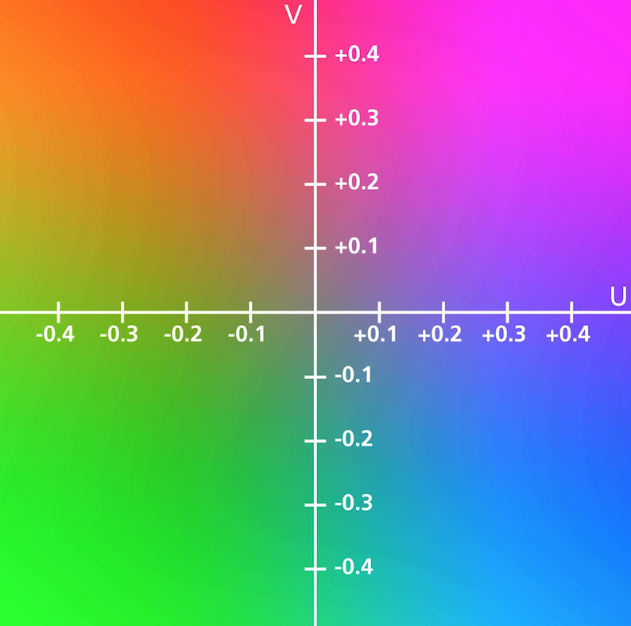

<script type="text/javascript" src="http://cdn.mathjax.org/mathjax/latest/MathJax.js?config=default"></script>

# 颜色空间

&nbsp;

## RGB

- R、G、B 分别代表红色（Red）、绿色（Green）、蓝色（Blue）

- 三个分量属性独立，取值范围均为 \\(0-255\\)：数值越大，颜色越亮

## HSV

- H、S、V 分别代表色相（Hue）、饱和度（Saturation）、亮度（Value）

- 解决了RGB三通道取值与所生成颜色联系不够直观的问题，可用于颜色分割

- 色相（H）指颜色的相位角，取值范围为 \\(0^{\circ}-360^{\circ}\\)：其中红色为 \\(0^{\circ}\\)，绿色为 \\(120^{\circ}\\)，蓝色为 \\(240^{\circ}\\)

- 饱和度（S）指颜色的纯度，取值范围为 \\(0.0-1.0\\)：数值越大，颜色越纯

- 亮度（V）指色彩的明亮程度，取值范围为 \\(0.0-1.0\\)：数值越大，颜色越亮


## YUV

- Y、U、V 分别表示亮度（Luma）、色度（Chroma）

- 如果只有 Y 通道信号，图像显示为黑白图像，解决了彩色电视机与黑白电视机兼容问题

- 由于人体特征的特殊性，可用 V 通道信号进行肤色区域检测

- 亮度（Y）指图像的灰度值，取值范围为 \\(0-255\\)：数值越大，颜色越亮

- 色度（U）指图像蓝色部分与 RGB 图像间的亮度差异，取值范围为 \\(0.0-1.0\\)：数值越大，对应像素越接近蓝色

- 色度（V）指图像红色部分与 RGB 图像间的亮度差异，取值范围为 \\(0.0-1.0\\)：数值越大，对应像素越接近红色

 

## Python 实现

- 显示 RGB 空间的每个通道

	- OpenCV 按 B、G、R 三个通道存储每个像素值

	```
	empty = numpy.zeros((height, width), numpy.uint8)
	b, g, r = cv2.split(image)
	
	bb = cv2.merge([b, empty, empty])
	gg = cv2.merge([empty, g, empty])
	rr = cv2.merge([empty, empty, r])
	```

- 显示 HSV 空间的每个通道

	- 转换到 HSV 空间时：H 通道取值为 \\(0^{\circ}-180^{\circ}\\)，S、V 通道取值均为 \\(0-255\\)

	```
	empty = numpy.zeros((height, width), numpy.uint8)
	full = 255 * numpy.ones((height, width), numpy.uint8)
	hsv = cv2.cvtColor(bgr, cv2.COLOR_BGR2HSV)
	h, s, v = cv2.split(hsv)
	
	hh = cv2.cvtColor(cv2.merge([h, full, full]), cv2.COLOR_HSV2BGR)
	ss = cv2.cvtColor(cv2.merge([empty, s, full]), cv2.COLOR_HSV2BGR)
	vv = cv2.cvtColor(cv2.merge([empty, empty, v]), cv2.COLOR_HSV2BGR)
	``` 
	
- 显示 YUV 空间的每个通道

	- 转换到 YUV 空间时：Y、U、V 通道取值均为 \\(0-255\\)

	```
	half = 128 * numpy.ones((height, width), numpy.uint8)
	yuv = cv2.cvtColor(bgr, cv2.COLOR_BGR2YUV)
	y, u, v = cv2.split(yuv)
	yy = cv2.cvtColor(cv2.merge([y, half, half]), cv2.COLOR_YUV2BGR)
	uu = cv2.cvtColor(cv2.merge([half, u, half]), cv2.COLOR_YUV2BGR)
	vv = cv2.cvtColor(cv2.merge([half, half, v]), cv2.COLOR_YUV2BGR)
	```