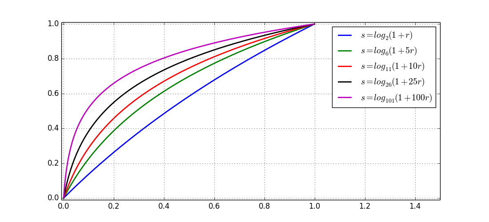

<script type="text/javascript" src="http://cdn.mathjax.org/mathjax/latest/MathJax.js?config=default"></script>

# 对比度增强

&nbsp;

## 背景介绍

- 增强图像中的有用信息，改善图像视觉效果

- 有目的地强调图像的整体或局部特性，将原来不清晰的图像变得清晰

- 强调某些感兴趣的特征，抑制不感兴趣的特征，扩大图像中不同物体特征之间的差别

- 分为两大类：

	- 间接对比度增强

		- 通过操作图像直方图来增强对比度

			- 直方图拉伸

			- 直方图均衡化

	- 直接对比度增强

		- 直接在操作原始图像来增强对比度

			- \\( Log \\) 变换

			- \\( Gamma \\) 变换

## 间接对比度增强

- 直方图拉伸

	- 参考 [Histogram.md] (Histogram.md)

- 直方图均衡化

	- 参考 [Histogram.md] (Histogram.md)

## 直接对比度增强

- \\( Log \\) 变换

	- \\( s = c \cdot log _ {v+1} (1 + v \cdot r) \\)，其中 \\( r \in [0, 1] \\)，而 \\( c, v \\) 为常数

	- \\( Log \\) 变换可以将图像的低灰度值部分扩展，显示低灰度部分更多的细节；将图像的高灰度值部分压缩，减少高灰度值部分的细节，从而增强图像低灰度部分
	
	- 由于 \\( s \approx c + c \cdot log _ {v+1} (r) \\)，在区间 \\( [0, 1] \\) 内，底数越大，图像越陡峭 ，对低灰度值部分的扩展越强，对高灰度值部分的压缩也越强

	

- \\( Gamma \\) 变换

	- \\( s = c \cdot r ^ {\gamma} \\)，其中 \\( r \in [0, 1] \\)，而 \\( c, v \\) 为常数

	- 当 \\( \gamma \\) 值确定时，\\( s \\) 是 \\( r \\) 的幂函数，且以 1 为分界线

		- 值越小，对图像低灰度值部分的扩展作用越明显

		- 值越大，对图像高灰度值部分的扩展作用越明显

	- 通过不同的 \\( \gamma \\) 值，可以达到增强低灰度或高灰度部分细节的作用
	
	 

&nbsp;

## Python 实现

- 直方图拉伸

	- 参考 [Histogram.md] (Histogram.md)

- 直方图均衡化（只处理单通道）

	- 参考 [Histogram.md] (Histogram.md)

- \\( Log \\) 变换

	```
	image = cv2.normalize(image, None, 0.0, 1.0, cv2.NORM_MINMAX, dtype=cv2.CV_32F)
	response = c * numpy.log2(1 + v * image) / numpy.log2(v + 1)
	```

- \\( Gamma \\) 变换

	```
	image = cv2.normalize(image, None, 0.0, 1.0, cv2.NORM_MINMAX, dtype=cv2.CV_32F)
	response = c * numpy.power(image, gamma)
	```