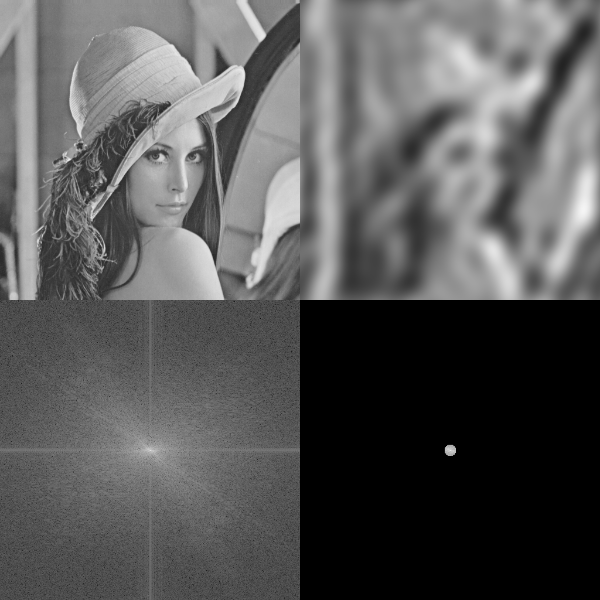
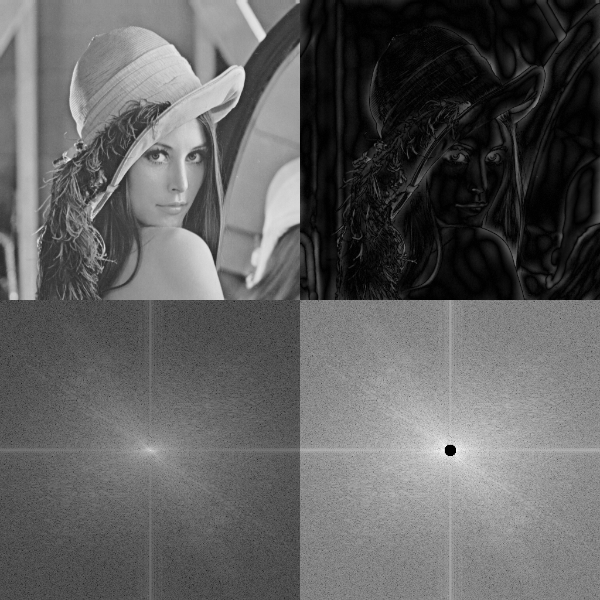
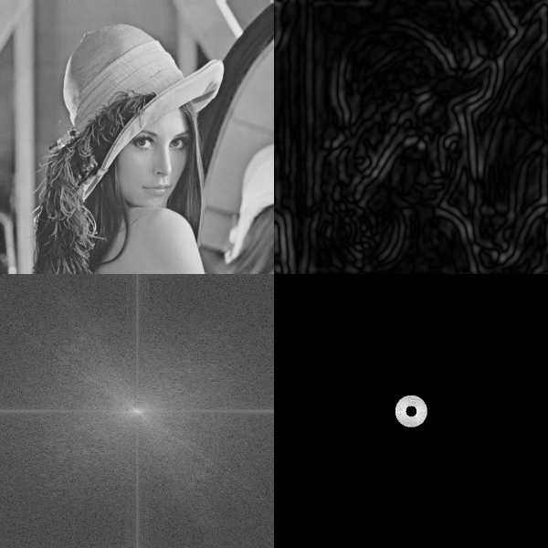

<script type="text/javascript" src="http://cdn.mathjax.org/mathjax/latest/MathJax.js?config=default"></script>

# 图像滤波

&nbsp;

## 背景介绍

- 目的：

	- 提取图像的特征用于后续图像识别

	- 消除图像数字化时混入的噪声

- 要求：

	- 不能损坏图像的边缘、轮廓信息

	- 使图像视觉效果更清晰

- 分为两大类：

	- 空间域滤波

		- 直接对原始图像的灰度值进行操作

			- 图像平滑

			- 图像锐化

			- 边缘检测

	- 频率域滤波

		- 当图像噪声有规律时，相当于某个频率波的振幅增大，把该振幅减小即可去噪

		- 通过傅立叶变换，对图像的频率进行操作

			- 低通滤波

			- 高通滤波

			- 带通滤波

## 空间域滤波

- 图像平滑

	- 参考 [Smoothing.md] (Smoothing.md)

- 图像锐化（TODO）

- 边缘检测（TODO）

## 频率域滤波

- 低通滤波

	- 保留图像中的低频分量：保留图像的基本结构

		

- 高通滤波

	- 保留图像中的高频分量：保留图像的细节信息
	
		

- 带通滤波

	- 保留图像中特定频率范围内的分量

		

&nbsp;

## Python 实现

- 图像平滑

	- 参考 [Smoothing.md] (Smoothing.md)

- 图像锐化（TODO）

- 边缘检测（TODO）

- 频率域滤波
	
	```
	transform = cv2.dft(numpy.float32(image), flags=cv2.DFT_COMPLEX_OUTPUT)
	transform = numpy.fft.fftshift(transform)
	
	transform = transform * mask
	
	transform = numpy.fft.ifftshift(transform)
	transform = cv2.idft(transform, flags=cv2.DFT_SCALE)
	
	magnitude = cv2.magnitude(transform[:, :, 0], transform[:, :, 1])
	response = numpy.uint8(numpy.round(magnitude))
	```