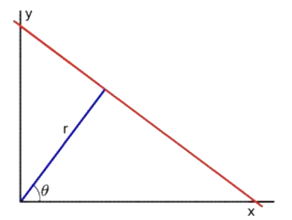
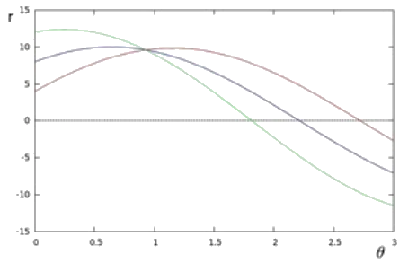

<script type="text/javascript" src="http://cdn.mathjax.org/mathjax/latest/MathJax.js?config=default"></script>

# 霍夫变换

## 标准霍夫线变换

### 原理分析

- 在笛卡尔坐标系中，除了与 \\(x\\) 轴垂直的直线，大部分直线 \\(y = kx + b\\) 可由斜率、截距 \\((k, b)\\) 表示

- 而在极坐标系中，包括与坐标轴垂直的直线在内，所有直线可由极径、极角 \\((r, \theta)\\) 表示

	
	
	- 红色直线可表示为：\\(y = \left(-\frac{\cos\theta}{\sin\theta}\right)x + \left(\frac{r}{\sin\theta}\right)\\)
	
	- 进一步化简得到：\\(r = x \cdot \cos\theta + y \cdot \sin\theta\\)

	- 一般来说，经过点 \\((x\_{0}, y\_{0})\\) 的一族直线可定义为：\\(r = x\_{0} \cdot \cos\theta + y\_{0} \cdot \sin\theta\\)，形状为正弦曲线；而曲线上的每个 \\((r, \theta)\\) 点都代表一条经过 \\((x\_{0}, y\_{0})\\) 的直线

	- 如果两族直线 \\(r\_{\theta\_{1}}, r\_{\theta\_{2}}\\) 在 \\(r-\theta\\) 平面内相交于点 \\((r\_{0}, \theta\_{0})\\)，说明该点代表的直线同时经过 \\((x\_{1}, y\_{1}), \ (x\_{2}, y\_{2})\\)，即两点在同一条直线上

	- 在 \\(r-\theta\\) 平面内，相交于某一点的曲线越多，该点代表的直线将由更多的点组成。因此，可以通过计算所有 \\((r, \theta)\\) 点处相交曲线的数量来寻找图像中的直线
	
	

### 算法流程

- 对图像进行边缘检测，并二值化处理

- 将所有非零像素点变换到霍夫空间并累加到霍夫表中，统计累加值

- 记录累加值大于阈值并且为邻域最大值的点

- 将上述 \\((r, \theta)\\) 点转换为直线，并进一步处理

## 概率霍夫线变换

### 算法流程

- 从边缘特征图中随机选取一个非零像素点：

	- 如果该点已被标定为某一条直线上的点，则继续随机选择非零像素点

- 将该点变换到霍夫空间，并累加到霍夫表中

- 选取霍夫空间表中值最大的点：

	- 如果该点小于阈值，继续从边缘特征图中随机选取非零像素点

	- 如果该点大于阈值，从该点出发沿着直线方向，寻找线段端点：

		- 如果线段长度超过某个阈值，则将该线段输出

## 霍夫圆变换

### 原理分析

- 在笛卡尔坐标系中，同一圆上的点满足同一方程：\\((x - a) ^ {2} + (y - b) ^ {2} = r ^ {2}, \quad (r > 0)\\)

- 经过点 \\((x\_{0}, y\_{0})\\) 的一族圆可定义为：\\((a - x\_{0}) ^ {2} + (b - y\_{0}) ^ {2} = r ^ {2}\\)，在 \\(a-b-r\\) 空间中的形状为锥体，锥面上任意一点 \\((a, b, r)\\) 都表示一个经过 \\((x\_{0}, y\_{0})\\) 的圆

- 如果两族圆在 \\(a-b-r\\) 空间内相交于点 \\((a\_{0}, b\_{0}, r\_{0})\\)，说明该点代表的圆同时经过 \\((x\_{1}, y\_{1}), \ (x\_{2}, y\_{2})\\)，即两点在同一个圆上

- 在 \\(a-b-r\\) 空间内，相交于某一点的圆越多，该点代表的圆将由更多的点组成。因此，可以通过计算所有 \\((a, b, r)\\) 点处相交圆的数量来寻找原图像中的圆形


### 算法流程

- 对图像进行边缘检测，并二值化处理

- 将所有非零像素点变换到霍夫空间并累加，统计累加值

- 记录在搜索半径范围内，累加值大于阈值并且为邻域最大值的点

- 将上述 \\((a, b, r)\\) 点转换为圆，并进一步处理

## Python 实现

### 标准霍夫线变换

```
edge = cv2.Canny(image, threshold1, threshold2)
lines = cv2.HoughLines(edge, rho=1, theta=np.pi/180, threshold=100)
for line in lines:
	rho, theta = line[0]
	process(rho, theta)
```

### 概率霍夫线变换

```
edge = cv2.Canny(image, threshold1, threshold2)
lines = cv2.HoughLinesP(edge, rho=1, theta=np.pi/180, threshold=100, maxLineGap=3)

for line in lines:
	x1, y1, x2, y2 = line[0]
	process((x1, y1), (x2, y2))
```

### 霍夫圆变换

```
# dp: image size / hough size
# minDist: min distance between circles
# param1: high threshold for canny edge (param1 / 2 for low threshold)
# param2: circle points threshold

circles = cv2.HoughCircles(image, cv2.HOUGH_GRADIENT, dp=1, minDist=50, param1=30, param2=50, minRadius=10, maxRadius=200)

for circle in circles[0]:
	x, y, r = circle
	process((x, y), r)
```