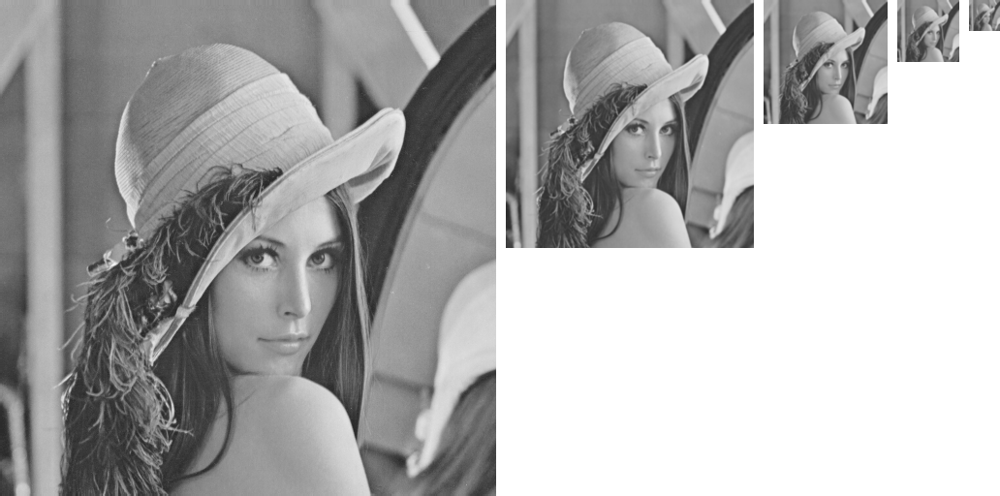
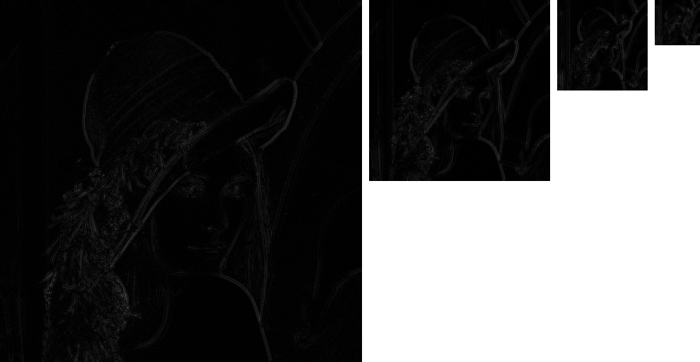

<script type="text/javascript" src="http://cdn.mathjax.org/mathjax/latest/MathJax.js?config=default"></script>

# 图像金字塔

## 下采样

- 将图像长、宽均缩小一半

- 先进行高斯平滑，再将偶数行、列去掉。高斯核为：

	$$ K = \frac{1}{256} \\left[ \\begin{matrix} 1 & 4 & 6 & 4 & 1 \\\\ 4 & 16 & 24 & 16 & 4 \\\\ 6 & 24 & 36 & 24 & 6 \\\\ 4 & 16 & 24 & 16 & 4 \\\\ 1 & 4 & 6 & 4 & 1 \\end{matrix} \\right] $$

## 上采样

- 将图像长、宽均扩大一倍

- 先将图像扩大一倍，偶数行、列用 0 填充，再进行高斯平滑。高斯核为：

	$$ K = \frac{4}{256} \\left[ \\begin{matrix} 1 & 4 & 6 & 4 & 1 \\\\ 4 & 16 & 24 & 16 & 4 \\\\ 6 & 24 & 36 & 24 & 6 \\\\ 4 & 16 & 24 & 16 & 4 \\\\ 1 & 4 & 6 & 4 & 1 \\end{matrix} \\right] $$

- 高斯核每个元素都扩大 4 倍，目的是保持图像亮度不变

## 高斯金字塔

- 通过不断下采样得到的一组图像，用来保留图像轮廓

- 图像越来越模糊，尺寸越来越小，相当于持续的低通滤波



## 拉普拉斯金字塔

- 拉普拉斯金字塔的每一层，是当前层高斯金字塔与上层高斯金字塔上采样得到图像的差值，用来保留图像边缘

- 由于保留的是当前层高斯金字塔的高频信息，而高斯金字塔不断进行低通滤波；因此拉普拉斯金字塔相当于持续的带通滤波



## Python 实现

### 下采样

```
sample = cv2.pyrDown(image)
```

### 上采样

```
sample = cv2.pyrUp(image)
```

### 高斯金字塔

```
gaussian[i] = cv2.pyrDown(gaussian[i - 1])
```

### 拉普拉斯金字塔

```
temp[i] = cv2.pyrUp(gaussian[i + 1])
laplacian[i] = cv2.absdiff(temp[i], gaussian[i])
```