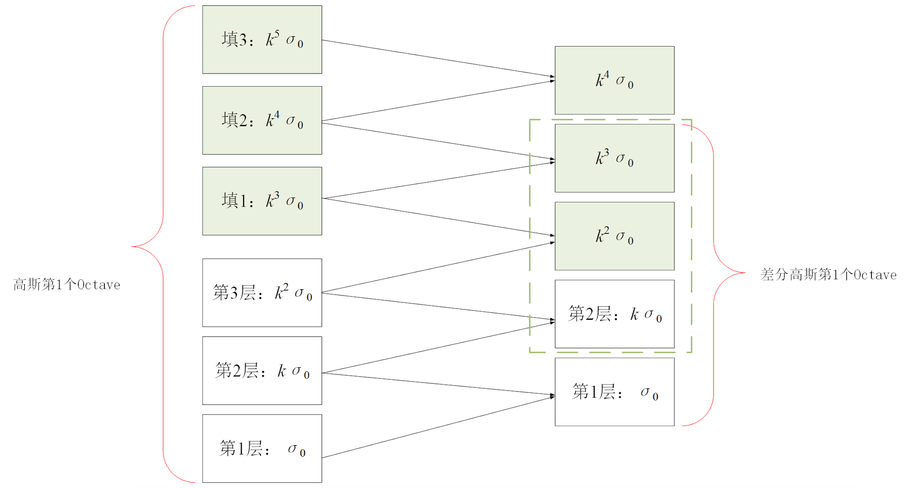
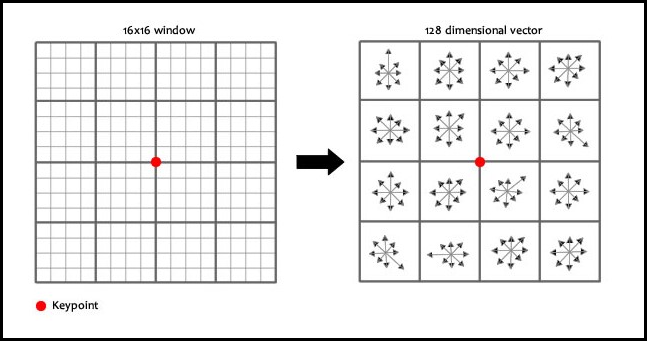

<script type="text/javascript" src="http://cdn.mathjax.org/mathjax/latest/MathJax.js?config=default"></script>

# SIFT 特征

&nbsp;

## 原理分析

- Scale Invariant Feature Transform

- 把同一物体不同尺度下的图像都提供给机器，让机器能够对物体在不同的尺度下有统一认知

- 对几何尺寸、旋转、光照等变化不敏感

- 特征向量的欧式距离作为特征点相似性的度量

- 分为 4 步：

	- 尺度空间极值检测

	- 特征点定位

	- 特征点方向确定

	- 特征向量生成

### 极值点检测

- 尺度空间的实现借助高斯金字塔、差分高斯金字塔，参考 [Pyramid.md] (Pyramid.md)

- 将高斯金字塔每组向上扩展 \\(3\\) 层，新的高斯金字塔每组有 \\(s+3\\) 层；相应地，在新的差分金字塔中，每组有 \\(s+2\\) 层

- 对于差分金字塔组中的中间 \\(s\\) 层的每个点，与其上层、同层、下层共 \\(9+8+9=26\\) 个位置比较，以判断该点是否为极值点

- 扩展金字塔的目的：

	- 保持差分金字塔中尺度空间连续性

	- 处理寻找极值点时每组的底层、顶层边界
		


### 特征点定位

#### 特征点精确定位

- 上一步寻找的极值点是离散极值点，需要对差分金字塔空间拟合，以寻找连续极值点

- 假设连续极值点是 \\(X=(x,y,\sigma)\\)，离散极值点是 \\(X\_{0}=(x\_{0},y\_{0},\sigma\_{0})\\)，差为 \\(\Delta X = X - X\_{0}\\)，差分高斯金字塔图像为 \\(D\\)

	- 根据泰勒展开：

	$$
	D(X) = D(X\_{0}) + \frac{\partial f^{T}}{\partial X}\Delta X + \frac{1}{2}\Delta X^{T}\frac{\partial^{2} f }{\partial X^{2}}\Delta X \qquad (1)
	$$
	
	- 对 \\(\Delta X\\) 求导并令导数为 \\(0\\)：
	
	$$
	\Delta X = -2(\frac{\partial^{2} f}{\partial X^{2}} + \frac{\partial^{2}f^{T}}{\partial X^{2}})^{-1}\frac{\partial f}{\partial X}
	$$

	- 根据 \\(\frac{\partial^{2}f}{\partial X^{2}}\\) 对称性：

	$$
	\Delta X = -\frac{\partial^{2} f^{-1}}{\partial X^{2}}\frac{\partial f}{\partial X} \qquad
	$$
	
	- 代入 \\((1)\\) 最后一项：

	$$
	D(X) = D(X\_{0}) + \frac{1}{2}\frac{\partial f^{T}}{\partial X}\Delta X \qquad (2)
	$$
	
- 如果 \\((2)\\) 中 \\(|D(X)|\\) 小于某个经验值（\\(D\_{0}=0.03\\)），则删除该极值点

#### 消除不稳定特征点

- 设特征点处 \\(Hessian\\) 矩阵 \\(H=\\left[ \\begin{matrix} D\_{xx} & D\_{xy} \\\\ D\_{yx} & D\_{yy} \\end{matrix} \\right]\\) 的两个特征值分别为 \\(\alpha, \beta\\)

- 由特征值与迹、行列式关系：

	$$
	Tr(H) = \alpha + \beta
	$$

	$$
	Det(H) = \alpha\beta
	$$

- 设 \\(\alpha > \beta, \ \alpha = r\beta\\)，定义主曲率：

	$$
	\frac{Tr(H)^{2}}{Det(H)} = \frac{(\alpha + \beta)^{2}}{\alpha\beta} = \frac{(r\beta + \beta)^{2}}{r\beta^{2}} = \frac{(1+r)^{2}}{r}
	$$

- 如果主曲率大于某个经验值（\\(r\_{0}=10\\)），则删除该特征点

### 特征点方向确定

- 对于检测到的特征点，在高斯金字塔相应层中计算其半径为 \\(1.5 * \sigma\\) 的邻域内所有点的幅值 \\(m(x,y)\\) 和方向 \\(\theta(x,y)\\)：

	$$
	m(x,y) = \sqrt{[L(x,y+1) - L(x,y-1)]^{2} + [L(x+1,y) - L(x-1,y)]^{2}}
	$$
	
	$$
	\theta(x,y) = arctan \left( \frac{L(x,y+1) - L(x,y-1)}{L(x+1,y) - L(x-1,y)}\right)
	$$

- 通过标准差为 \\(1.5\sigma\\) 的高斯核对邻域内所有点的幅值进行加权

- 统计邻域内所有点的方向直方图，将直方图峰值处定义为特征点主方向：

	- 分成 8 段，每段表示 \\(45^{\circ}\\) 区间

	- 每一段的值为相应范围内的点加权后的幅值

### 特征向量生成

- 将坐标轴旋转到特征点主方向，以消除旋转角度对特征的影响

- 并重新计算 16 * 16 邻域内所有点的方向和加权幅值

- 将 16 * 16 邻域进一步细分为 16 个 4 * 4 区域：

	- 统计每个 4 * 4 区域的 8 向直方图，生成一个 8 维向量

	- 将所有 8 维向量拼接成 16 * 8 = 128 维向量

- 将该 128 维向量作为该点的特征向量并归一化，以消除光照的影响



&nbsp;

## Python 实现

```
detector = cv2.xfeatures2d.SIFT_create()
key_points1, descriptor1 = detector.detectAndCompute(image1, None)
key_points2, descriptor2 = detector.detectAndCompute(image2, None)

FLANN_INDEX_KDTREE = 0
index_params = dict(algorithm=FLANN_INDEX_KDTREE, trees=5)
search_params = dict(checks=50)  # search depth

flann = cv2.FlannBasedMatcher(index_params, search_params)
matches = flann.knnMatch(descriptor1, descriptor2, k=2)

matches_mask = [[0, 0] for i in xrange(len(matches))]
for i, (first, second) in enumerate(matches):
	if first.distance < 0.5 * second.distance:
		matches_mask[i] = [1, 0]
draw_params = dict(matchesMask= matches_mask, flags=0)

match_result = cv2.drawMatchesKnn(image1, key_points1, image2, key_points2, matches, None, **draw_params)
drawn_points1 = cv2.drawKeypoints(image1, key_points1, None)
drawn_points2 = cv2.drawKeypoints(image2, key_points2, None)
```